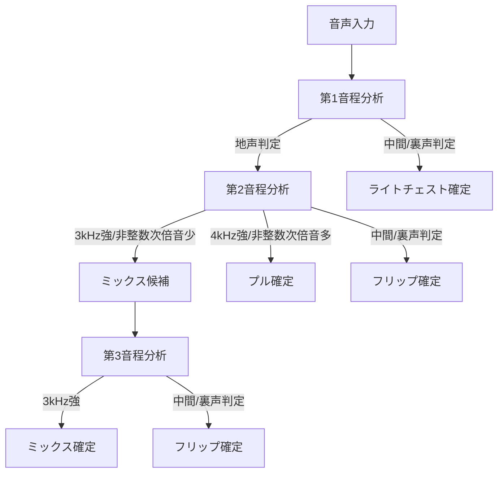

# 更新版ボイスタイプ分析機能の仕組み

## 1. 概要

ボイスタイプ分析機能は、ユーザーの音声を分析し、4つのボイスタイプ（プル、ライトチェスト、フリップ、ミックス）のいずれかに分類するシステムです。本ドキュメントでは、更新された分析手法について説明します。

## 2. 基本設計

### 2.1 分析対象の音程

- **男性**: E3, E4, A4
- **女性**: A3, A4, E5

### 2.2 ボイスタイプの定義

- **ライトチェスト**: 基音成分が強く、高周波成分が少ない、裏声的な特徴を持つ
- **プル**: 4kHz周辺の成分が強く、非整数次倍音が多い、地声的な特徴を持つ
- **フリップ**: 低音と高音で声質に著しい差、特定音程で声質が急激に変化
- **ミックス**: 3kHz周辺の成分が強く、非整数次倍音が少なく、全音程で声質が一貫

## 3. 更新された分析アルゴリズム

### 3.1 分析フロー

新しい分析手法では、3つの音程を順番に分析し、段階的にボイスタイプを判定します。



### 3.2 第1音程の分析（最低音）

最初に最も低い音程（男性：E3、女性：A3）を分析し、ライトチェストかどうかを判定します。

1. 地声/裏声診断を実行
   - スペクトル傾斜の分析
   - 2.5kHz以上の高周波成分の強度チェック
2. 判定基準：
   - 中間または裏声の判定が出た場合 → **ライトチェスト確定**
   - 地声の判定が出た場合 → 第2音程の分析へ進む

### 3.3 第2音程の分析（中間音）

第1音程で地声と判定された場合、中間の音程（男性：E4、女性：A4）を分析します。

1. 周波数成分の分析：
   - 3kHz周辺の成分の強度
   - 4kHz周辺の成分の強度
   - 非整数次倍音の量
   - 地声/裏声診断

2. 判定基準：
   - 4kHz周辺の成分が強く、非整数次倍音が多い → **プル確定**
   - 中間または裏声の判定が出た場合 → **フリップ確定**
   - 3kHz周辺の成分が強く、非整数次倍音が少ない → ミックス候補として第3音程の分析へ

### 3.4 第3音程の分析（最高音）

第2音程でミックス候補となった場合、最も高い音程（男性：A4、女性：E5）を分析します。

1. 周波数成分の分析：
   - 3kHz周辺の成分の強度
   - 地声/裏声診断

2. 判定基準：
   - 3kHz周辺の音が強く出ている → **ミックス確定**
   - 中間または裏声の判定が出た場合 → **フリップ確定**

## 4. 地声/裏声診断の更新

地声/裏声の判別アルゴリズムも更新され、以下の2つの条件を組み合わせて判定します：

### 4.1 スペクトル傾斜による判定

- スペクトル傾斜が急（-6～-10 dB/oct）→ 地声傾向
- スペクトル傾斜が緩やか（-13～-18 dB/oct）→ 裏声傾向

### 4.2 高周波成分の強度による判定（新規追加）

- 2.5kHz以上の高周波成分の中で、基音に対して3分の1以上の強さを持つ成分がある → 地声傾向
- 3分の1以上の強さを持つ成分がない → 裏声傾向

### 4.3 総合判定

- 両方の条件で地声傾向 → 地声
- 両方の条件で裏声傾向 → 裏声
- 条件が分かれる場合 → 中間

## 5. 実装のポイント

### 5.1 地声/裏声診断の実装

```typescript
/**
 * 地声/裏声を診断する
 * @param frequencyData 周波数データ
 * @param baseFrequency 基音周波数
 * @param sampleRate サンプリングレート
 * @returns 'chest'（地声）, 'falsetto'（裏声）, 'middle'（中間）のいずれか
 */
diagnoseVoiceRegister(
  frequencyData: Uint8Array,
  baseFrequency: number,
  sampleRate: number
): 'chest' | 'falsetto' | 'middle' {
  // 1. スペクトル傾斜の分析
  const harmonicResult = this.analyzeHarmonicComponents(
    frequencyData,
    baseFrequency,
    baseFrequency * 2,
    baseFrequency * 3,
    sampleRate
  );
  
  // スペクトル傾斜による判定
  const isChestBySlope = harmonicResult.spectralSlope >= -10;
  const isFalsettoBySlope = harmonicResult.spectralSlope <= -13;
  
  // 2. 高周波成分の強度チェック
  const baseAmplitude = this.getAmplitudeAtFrequency(frequencyData, baseFrequency, sampleRate);
  const hasStrongHighFreq = this.hasStrongHighFrequencyComponents(
    frequencyData,
    baseAmplitude,
    2500, // 2.5kHz
    sampleRate
  );
  
  // 3. 総合判定
  if (isChestBySlope && hasStrongHighFreq) {
    return 'chest';
  } else if (isFalsettoBySlope && !hasStrongHighFreq) {
    return 'falsetto';
  } else {
    return 'middle';
  }
}

/**
 * 2.5kHz以上の高周波成分の中で、基音に対して3分の1以上の強さを持つ成分があるかチェック
 */
hasStrongHighFrequencyComponents(
  frequencyData: Uint8Array,
  baseAmplitude: number,
  minFrequency: number,
  sampleRate: number
): boolean {
  const fftSize = frequencyData.length * 2;
  const minIndex = Math.floor((minFrequency / sampleRate) * fftSize);
  const threshold = baseAmplitude / 3; // 基音の3分の1の強さ
  
  for (let i = minIndex; i < frequencyData.length; i++) {
    if (frequencyData[i] >= threshold) {
      return true;
    }
  }
  
  return false;
}
```

### 5.2 ボイスタイプ判定の実装

```typescript
/**
 * 複数の音程の音声を分析してボイスタイプを判定する
 * @param frequencyDataArrays 各音程の周波数データ配列のマップ
 * @param gender 性別（'male'または'female'）
 * @returns ボイスタイプ分析結果
 */
analyzeMultiplePitches(
  frequencyDataArrays: Record<string, Uint8Array[]>,
  gender: 'male' | 'female'
): VoiceTypeAnalysisResult {
  // 使用する音程セット
  const pitchSet = this.genderPitchSets[gender];
  const lowPitch = pitchSet[0];  // 最低音
  const midPitch = pitchSet[1];  // 中間音
  const highPitch = pitchSet[2]; // 最高音
  
  // 第1音程の分析（ライトチェストのチェック）
  const lowPitchData = frequencyDataArrays[lowPitch.id];
  const lowPitchRegister = this.diagnoseVoiceRegister(
    lowPitchData[0], // 最初のフレームを使用
    lowPitch.frequency,
    sampleRate
  );
  
  // ライトチェストの判定
  if (lowPitchRegister === 'falsetto' || lowPitchRegister === 'middle') {
    return {
      voiceType: 'lightChest',
      confidence: 0.8,
      parameters: { /* パラメータ省略 */ }
    };
  }
  
  // 第2音程の分析（プル、フリップ、ミックスのチェック）
  const midPitchData = frequencyDataArrays[midPitch.id];
  const midPitchRegister = this.diagnoseVoiceRegister(
    midPitchData[0],
    midPitch.frequency,
    sampleRate
  );
  
  // 3kHzと4kHz周辺の強度を分析
  const strength3kHz = this.analyzeFrequencyBandStrength(midPitchData[0], 2800, 3200, sampleRate);
  const strength4kHz = this.analyzeFrequencyBandStrength(midPitchData[0], 3800, 4200, sampleRate);
  const nonIntegerHarmonics = this.analyzeNonIntegerHarmonics(midPitchData[0], midPitch.frequency, sampleRate);
  
  // プルの判定
  if (strength4kHz > 0.6 && nonIntegerHarmonics > 0.5) {
    return {
      voiceType: 'pull',
      confidence: 0.8,
      parameters: { /* パラメータ省略 */ }
    };
  }
  
  // フリップの判定
  if (midPitchRegister === 'falsetto' || midPitchRegister === 'middle') {
    return {
      voiceType: 'flip',
      confidence: 0.8,
      parameters: { /* パラメータ省略 */ }
    };
  }
  
  // ミックス候補の場合、第3音程の分析へ
  if (strength3kHz > 0.6 && nonIntegerHarmonics < 0.3) {
    const highPitchData = frequencyDataArrays[highPitch.id];
    const highPitchRegister = this.diagnoseVoiceRegister(
      highPitchData[0],
      highPitch.frequency,
      sampleRate
    );
    
    const highStrength3kHz = this.analyzeFrequencyBandStrength(
      highPitchData[0],
      2800,
      3200,
      sampleRate
    );
    
    // ミックスの最終判定
    if (highStrength3kHz > 0.6) {
      return {
        voiceType: 'mixed',
        confidence: 0.8,
        parameters: { /* パラメータ省略 */ }
      };
    } else if (highPitchRegister === 'falsetto' || highPitchRegister === 'middle') {
      return {
        voiceType: 'flip',
        confidence: 0.7,
        parameters: { /* パラメータ省略 */ }
      };
    }
  }
  
  // 判定できない場合
  return {
    voiceType: 'unknown',
    confidence: 0.5,
    parameters: { /* パラメータ省略 */ }
  };
}
```

## 6. まとめ

更新されたボイスタイプ分析機能は、3つの音程を段階的に分析し、より正確なボイスタイプ判定を行います。特に以下の点が改善されています：

1. **段階的な判定プロセス**：各音程ごとに特定のボイスタイプの特徴を確認
2. **地声/裏声診断の精度向上**：スペクトル傾斜に加えて高周波成分の強度も考慮
3. **特定周波数帯域の分析強化**：3kHz、4kHz周辺の成分の強度を詳細に分析
4. **非整数次倍音の考慮**：プルとミックスの区別に非整数次倍音の量を活用

これらの改善により、特にフリップの過剰検出問題が解消され、より正確なボイスタイプ分類が可能になると期待されます。