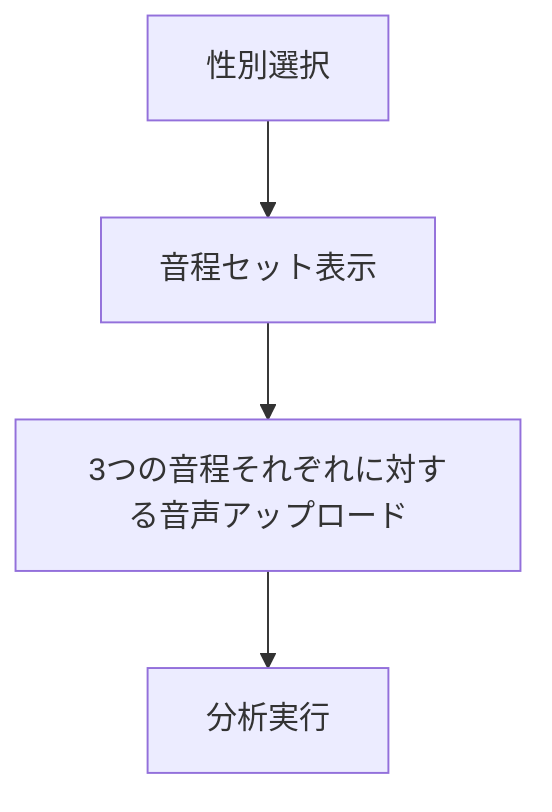

# ボイスタイプ診断機能 実装計画

## 1. UI変更計画

### 1.1 VoiceTypeUploader.vue の修正

現在の `VoiceTypeUploader.vue` は単一の音声ファイルをアップロードして音高を選択するUIですが、これを以下のように変更します：



#### 主な変更点：

1. **性別選択コンポーネントの追加**
   - ラジオボタンまたはタブで男性/女性を選択
   - 選択に応じて適切な音程セットを表示

2. **音程ガイドコンポーネントの追加**
   - 男性：E3, E4, A4
   - 女性：A3, A4, E5
   - 各音程の参考音を再生できるボタン

3. **複数音声アップロードの対応**
   - 3つの音程それぞれに対応する音声ファイルをアップロード
   - 各音程の録音/アップロード状態を表示
   - すべての音程がアップロードされたら分析ボタンを有効化

#### コンポーネント構造：

```vue
<template>
  <div class="voice-type-uploader">
    <!-- 性別選択 -->
    <v-card class="mb-6">
      <v-card-title>性別選択</v-card-title>
      <v-card-text>
        <v-radio-group v-model="gender">
          <v-radio label="男性" value="male"></v-radio>
          <v-radio label="女性" value="female"></v-radio>
        </v-radio-group>
      </v-card-text>
    </v-card>
    
    <!-- 音程ガイド -->
    <v-card class="mb-6">
      <v-card-title>音程ガイド</v-card-title>
      <v-card-text>
        <div v-for="(pitch, index) in pitchSet" :key="index">
          <div class="d-flex align-center">
            <span>{{ pitch.name }} ({{ pitch.frequency }} Hz)</span>
            <v-btn icon @click="playReferenceTone(pitch.frequency)">
              <v-icon>mdi-play</v-icon>
            </v-btn>
          </div>
        </div>
      </v-card-text>
    </v-card>
    
    <!-- 音声アップロード（3つの音程それぞれ） -->
    <v-card v-for="(pitch, index) in pitchSet" :key="index" class="mb-6">
      <v-card-title>{{ pitch.name }} の音声をアップロード</v-card-title>
      <v-card-text>
        <!-- 音声アップロードコンポーネント -->
        <!-- 録音/再生コントロール -->
      </v-card-text>
    </v-card>
    
    <!-- 分析ボタン -->
    <v-btn
      color="primary"
      :disabled="!allPitchesUploaded"
      @click="analyzeVoiceType"
    >
      ボイスタイプを分析
    </v-btn>
  </div>
</template>
```

### 1.2 VoiceVisual.vue の修正

`VoiceVisual.vue` の「ボイスタイプ分析」タブを修正して、4つのボイスタイプ（プル、ライトチェスト、フリップ、ミックス）の結果表示に対応します。

#### 主な変更点：

1. **結果表示の拡張**
   - 4つのボイスタイプに対応した表示
   - 各ボイスタイプの特徴説明を追加

2. **分析パラメータ表示の拡張**
   - 3つの音程それぞれの分析結果を表示
   - 音程間の変化パターンを視覚化

#### コンポーネント構造：

```vue
<!-- ボイスタイプ分析結果表示 -->
<v-card v-if="voiceTypeAnalysisResult && activeTab === 'voicetype'" class="mt-6">
  <v-card-title class="text-center text-h5">
    <v-icon start icon="mdi-account-voice" class="mr-2"></v-icon>
    ボイスタイプ分析結果
  </v-card-title>
  
  <v-card-text>
    <v-row>
      <!-- 声質タイプの表示 -->
      <v-col cols="12" class="text-center">
        <v-chip
          size="x-large"
          :color="getVoiceTypeColor(voiceTypeAnalysisResult.voiceType)"
          class="pa-4 mb-4"
        >
          <v-icon start>{{ getVoiceTypeIcon(voiceTypeAnalysisResult.voiceType) }}</v-icon>
          <span class="text-h6">{{ getVoiceTypeName(voiceTypeAnalysisResult.voiceType) }}</span>
        </v-chip>
        
        <!-- 確信度表示 -->
        <div class="mt-2">
          <span class="text-subtitle-1">確信度: {{ Math.round(voiceTypeAnalysisResult.confidence * 100) }}%</span>
          <v-progress-linear
            :model-value="voiceTypeAnalysisResult.confidence * 100"
            :color="getVoiceTypeColor(voiceTypeAnalysisResult.voiceType)"
            height="10"
            rounded
            class="mt-2"
          ></v-progress-linear>
        </div>
      </v-col>
      
      <!-- パラメータ表示 -->
      <!-- 各音程ごとの分析結果 -->
      <!-- ボイスタイプの特徴説明 -->
    </v-row>
  </v-card-text>
</v-card>
```

## 2. データモデル変更計画

### 2.1 VoiceTypeAnalysisService.ts の修正

現在の `VoiceTypeAnalysisService.ts` は単一の音声ファイルを分析し、「ライトチェスト」と「プル」の2種類のボイスタイプを判定しています。これを以下のように変更します：

#### 主な変更点：

1. **ボイスタイプの拡張**
   ```typescript
   export type VoiceType = 'lightChest' | 'pull' | 'flip' | 'mixed' | 'unknown';
   ```

2. **複数音声分析メソッドの追加**
   ```typescript
   analyzeMultiplePitches(
     audioBuffers: { [pitchName: string]: AudioBuffer },
     gender: 'male' | 'female'
   ): VoiceTypeAnalysisResult
   ```

3. **フリップ検出アルゴリズムの追加**
   - 低音と高音の間の声質変化を検出
   - 同一音声内での声質変化を検出

4. **ミックス検出アルゴリズムの追加**
   - 全音程での声質一貫性を分析
   - 3kHz周辺の周波数成分の強度を測定

## 3. 実装ステップ

1. **VoiceTypeUploader.vue の修正**
   - 性別選択コンポーネントの追加
   - 音程ガイドコンポーネントの追加
   - 複数音声アップロード機能の実装

2. **VoiceTypeAnalysisService.ts の修正**
   - ボイスタイプの拡張
   - 複数音声分析メソッドの追加
   - フリップとミックスの検出アルゴリズムの実装

3. **VoiceVisual.vue の修正**
   - 4つのボイスタイプに対応した結果表示の実装
   - 分析パラメータ表示の拡張

4. **テストと調整**
   - 各ボイスタイプの判定精度の検証
   - UIの使いやすさの確認

## 4. 技術的考慮事項

1. **音声データの管理**
   - 3つの音声ファイルを効率的に管理する方法
   - 分析時のメモリ使用量の最適化

2. **参考音の生成**
   - WebAudio APIを使用して参考音を生成
   - 各音程の正確な周波数での音生成

3. **UIのレスポンシブ対応**
   - モバイルデバイスでの使いやすさ
   - 3つの音声アップロードUIのコンパクト化

## 5. 次のステップ

この実装計画に基づいて、Codeモードに切り替えて実際の実装を行います。まずは `VoiceTypeUploader.vue` の修正から始め、性別選択と3つの音程での録音/アップロード機能を実装します。