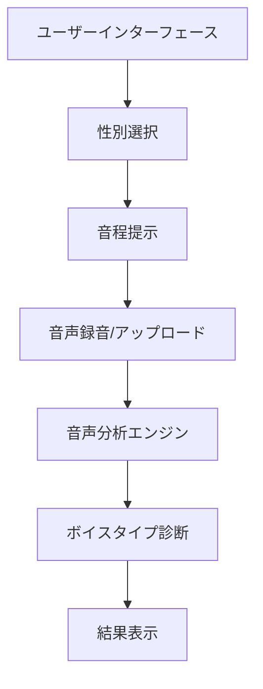
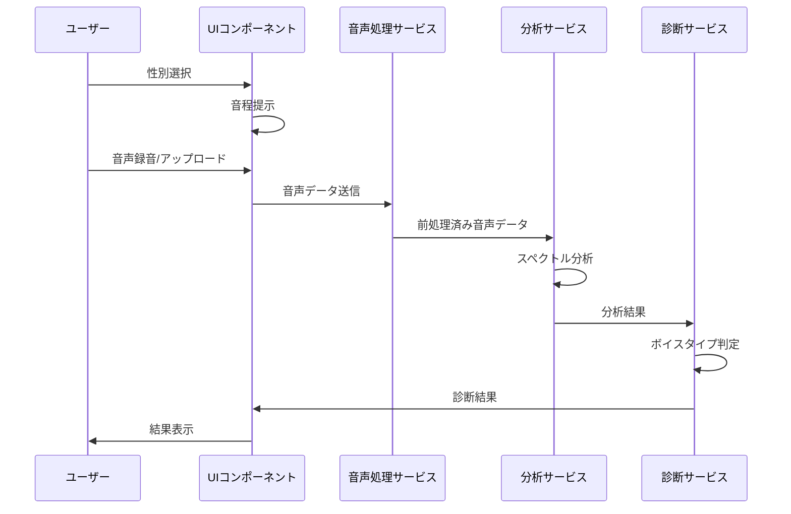

# ボイスタイプ診断機能 仕様書

## 1. 概要

本仕様書は、ボイスタイプ診断機能の実装方針変更に関する詳細を記述したものです。この機能は、ユーザーが発声した音声を分析し、4つのボイスタイプ（プル、ライトチェスト、フリップ、ミックス）のいずれかに分類することを目的としています。

## 2. 背景

現在の実装では、ユーザーが音声ファイルをアップロードし、その音声がどの音程を発声したものかを選択ボックスで指定する方式を採用しています。この方式では、ユーザーが自由に選んだ音程の音声を分析対象としていました。

しかし、より正確なボイスタイプ診断を行うためには、特定の音程パターンでの発声を分析することが効果的であることが判明しました。そのため、既定の3つの音程を用いた診断方式に変更します。

## 3. 機能要件

### 3.1 基本機能

1. ユーザーは性別（男性/女性）を選択できる
2. 選択した性別に応じた3つの基準音程を提示する
   - 男性：E3, E4, A4
   - 女性：A3, A4, E5
3. ユーザーは各音程に対応する音声を録音またはアップロードできる
4. システムは提供された3つの音声を分析し、ボイスタイプを診断する
5. 診断結果（プル、ライトチェスト、フリップ、ミックス）をユーザーに表示する

### 3.2 音声分析要件

各ボイスタイプの音響的特徴に基づいて分析を行います：

#### プル
- 音程：基準よりフラット（低め）になりやすい
- 声質：高音になるほど苦しく聞こえる
- 声量：大きい
- スペクトル特性：2倍音が基音と同等以上の強さ、3倍音も他タイプと比べて強い

#### ライトチェスト
- 声質：全ての音程で裏声（ファルセット）の特徴を持つ
- スペクトル特性：基音成分が倍音成分に対して強い
- 声量：小さい

#### フリップ
- 声質：低音と高音の間、または発声中に声質が著しく変化する
- 低音特性：倍音が豊かで声量が大きい
- 高音特性：基音優位になり声量が小さくなる
- 特徴的現象：フリップポイントでは声質が行ったり来たりする（ヨーデル的特徴）

#### ミックス
- 声質：低音から高音まで声質の変化が少ない
- 声量：全体的に大きい
- スペクトル特性：倍音成分が豊か
- 音色：明るく響きがよい（3kHz周辺の音が強い）

## 4. システム設計

### 4.1 全体アーキテクチャ

### 4.2 コンポーネント構成

1. **UI コンポーネント**
   - 性別選択コンポーネント
   - 音程ガイドコンポーネント
   - 音声録音/アップロードコンポーネント
   - 結果表示コンポーネント

2. **サービスレイヤー**
   - 音声処理サービス
   - スペクトル分析サービス
   - ボイスタイプ診断サービス

3. **データモデル**
   - 音声データモデル
   - 分析結果モデル
   - ボイスタイプモデル

### 4.3 データフロー

## 5. 実装方針

### 5.1 フロントエンド実装

#### 5.1.1 性別選択コンポーネント
- Vue.jsのラジオボタンまたはセレクトボックスを使用
- 選択に応じて適切な音程セットを表示

#### 5.1.2 音程ガイドコンポーネント
- 選択された性別に基づいて3つの音程を表示
- 各音程の参考音を再生できる機能を提供
- 音程の視覚的表示（ピアノキーボードなど）

#### 5.1.3 音声録音/アップロードコンポーネント
- 既存の`VoiceTypeUploader.vue`を拡張
- 3つの音程それぞれに対応する録音/アップロード機能
- 録音済み/アップロード済みの状態表示

#### 5.1.4 結果表示コンポーネント
- 診断されたボイスタイプを視覚的に表示
- 各ボイスタイプの特徴と説明を提供
- 音声の分析結果の詳細（オプション）を表示

### 5.2 バックエンド実装

#### 5.2.1 音声処理サービス
- WebAudioAPIを使用した音声処理
- 音声データのサンプリングと正規化
- 既存の`AudioService.ts`を拡張

#### 5.2.2 スペクトル分析サービス
- FFT（高速フーリエ変換）を使用した周波数分析
- 基音と倍音の強度測定
- 3kHz周辺の周波数帯域の分析
- 既存の`FrequencyAnalysisService.ts`を拡張

#### 5.2.3 ボイスタイプ診断サービス
- 既存の`VoiceTypeAnalysisService.ts`を拡張
- 「フリップ」と「ミックス」の判定アルゴリズムを追加
- 3つの音声サンプルの総合分析ロジックを実装

### 5.3 音響分析アルゴリズム

#### 5.3.1 音程精度分析
- 基準音程と実際の発声音程の差異を測定
- フラット傾向の検出（プルタイプの特徴）

#### 5.3.2 倍音構造分析
- 基音と倍音（2倍音、3倍音など）の強度比較
- 倍音パターンに基づくボイスタイプの特徴抽出

#### 5.3.3 声質変化検出
- 同一音声内での声質変化の検出（フリップの特徴）
- 3つの音程間での声質一貫性の分析（ミックスの特徴）

#### 5.3.4 声量分析
- 音声の平均エネルギーレベルの測定
- 音程による声量変化パターンの分析

#### 5.3.5 3kHz帯域分析
- 3kHz周辺の周波数成分の強度測定
- 「明るさ」「響き」の定量的評価

## 6. 判定基準

### 6.1 プルの判定基準
1. 音程が基準よりフラット傾向にある
2. 2倍音が基音と同等以上の強度を持つ
3. 3倍音が他タイプと比較して強い
4. 声量が大きい
5. 高音になるほど「苦しさ」の指標が増加

### 6.2 ライトチェストの判定基準
1. 基音成分が倍音成分に対して強い
2. 声量が小さい
3. 全ての音程で類似した倍音構造を持つ

### 6.3 フリップの判定基準
1. 低音と高音で声質（倍音構造）に著しい差がある
2. 低音では倍音が豊かで声量が大きい
3. 高音では基音優位で声量が小さい
4. 特定の音程で声質の急激な変化が検出される

### 6.4 ミックスの判定基準
1. 全ての音程で声質（倍音構造）が一貫している
2. 全体的に声量が大きい
3. 倍音成分が豊か
4. 3kHz周辺の周波数成分が強い

## 7. UI/UX設計

### 7.1 画面遷移

### 7.2 画面レイアウト

#### 7.2.1 性別選択画面
- シンプルな選択UI（ラジオボタンまたはタブ）
- 男性/女性の選択肢
- 「次へ」ボタン

#### 7.2.2 音声録音/アップロード画面
- 3つの音程（男性：E3, E4, A4 または 女性：A3, A4, E5）を表示
- 各音程に対応する録音/アップロードコントロール
- 参考音再生ボタン
- 録音済み/アップロード済みの状態表示
- 「分析開始」ボタン

#### 7.2.3 結果表示画面
- 診断されたボイスタイプを大きく表示
- ボイスタイプの簡単な説明
- 詳細分析結果へのリンク
- 「もう一度診断する」ボタン

## 8. テスト計画

### 8.1 単体テスト
- 各コンポーネントの機能テスト
- 各サービスの機能テスト
- 分析アルゴリズムの精度テスト

### 8.2 統合テスト
- コンポーネント間の連携テスト
- サービス間の連携テスト
- フロントエンドとバックエンドの連携テスト

### 8.3 ユーザーテスト
- 異なるボイスタイプを持つ被験者による精度検証
- UI/UXの使いやすさ評価
- パフォーマンス評価

## 9. 実装スケジュール

1. 要件分析と設計：1週間
2. フロントエンドUI実装：2週間
3. 音声処理サービス拡張：1週間
4. スペクトル分析サービス拡張：2週間
5. ボイスタイプ診断サービス実装：2週間
6. 統合とテスト：2週間
7. バグ修正と改善：1週間

合計：11週間

## 10. 参考文献

1. Sundberg, J. (1987). The Science of the Singing Voice. Northern Illinois University Press.
2. Titze, I. R. (2000). Principles of Voice Production. National Center for Voice and Speech.
3. Estill, J. (2005). Estill Voice Training: Level One, Figures for Voice Control. Estill Voice Training Systems.
4. Lovetri, J. (2008). Contemporary Commercial Music. Journal of Voice, 22(3), 260-262.
5. Henrich, N. (2006). Mirroring the voice from Garcia to the present day: Some insights into singing voice registers. Logopedics Phoniatrics Vocology, 31(1), 3-14.

## 11. 付録

### 11.1 音程参照表

| 音名 | 周波数 (Hz) | 性別 |
|------|------------|------|
| E3   | 164.81     | 男性 |
| A3   | 220.00     | 女性 |
| E4   | 329.63     | 男性 |
| A4   | 440.00     | 男性/女性 |
| E5   | 659.26     | 女性 |

### 11.2 ボイスタイプ特性まとめ

| ボイスタイプ | 音程傾向 | 倍音特性 | 声量 | 特徴的な周波数帯域 |
|------------|---------|---------|------|-----------------|
| プル       | フラット | 2倍音・3倍音が強い | 大きい | 中低域が強い |
| ライトチェスト | 安定   | 基音が強い | 小さい | 高域が弱い |
| フリップ    | 不安定  | 低音：倍音豊か 高音：基音優位 | 低音：大きい 高音：小さい | 音程により大きく変化 |
| ミックス    | 安定    | 倍音豊か | 大きい | 3kHz周辺が強い |